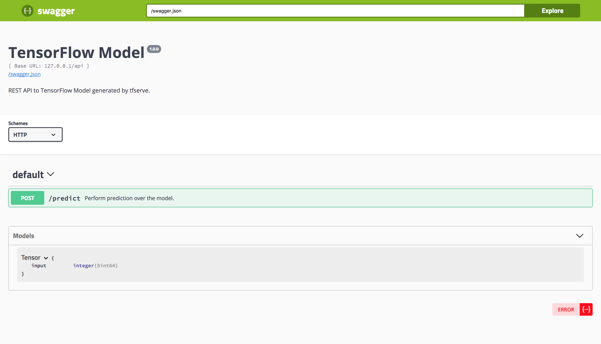

tfserve: Serves Tensorflow Models
================

`tfserve` provides a [GoogleML](https://cloud.google.com/ml-engine/docs/prediction-overview) compatiable REST API for predictions, which can be used to serve TensorFlow Models from R with ease.



For example, we can train MNIST as described by [MNIST For ML Beginners](https://tensorflow.rstudio.com/tensorflow/articles/tutorial_mnist_beginners.html) and then save using `SavedModelBuilder` and the right signature or, for conviniece, use a `tfserve` helper function as follows:

``` r
library(tfserve)

model_path <- "trained/tensorflow-mnist/1"
mnist_train_save(model_path)
```

    ## [1] "trained/tensorflow-mnist/1/saved_model.pb"

Then, we can serve this model with ease by running:

``` r
serve_savedmodel(model_path)
```

We can make use of the `pixels` HTMLWidget to manually collect a vector of pixels and pass them to the REST API from `tfserve` as follows:

``` r
library(pixels)
library(magrittr)

recognize_digit <- function() {
  pixels <- get_pixels()
  httr::POST(
    url = "http://127.0.0.1:8089/api/predict_images/predict/",
    body = list(
      instances = list(
        input = list(
            matrix(as.double(pixels), 28, 28, byrow = T) %>% as.vector()
        )
      )
    ),
    encode = "json"
  ) %>%
    httr::content(as = "text") %>%
    jsonlite::fromJSON() %>%
    as.vector() %>%
    round(digits = 1) %>%
    as.logical() %>%
    which() - 1
}

recognize_digit()
```


